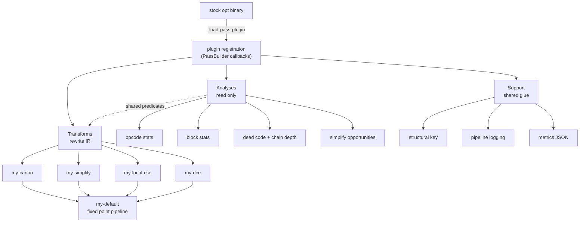
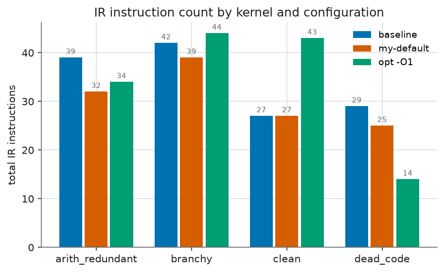
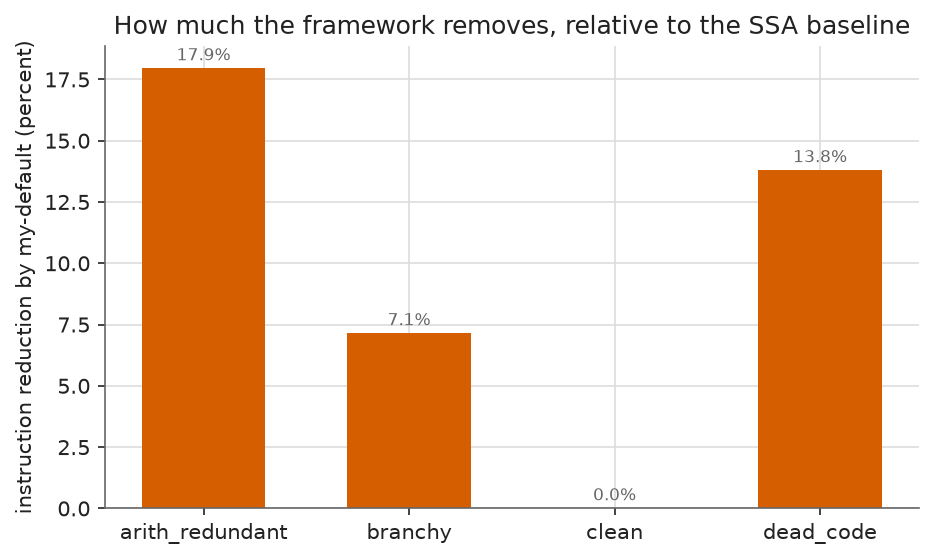
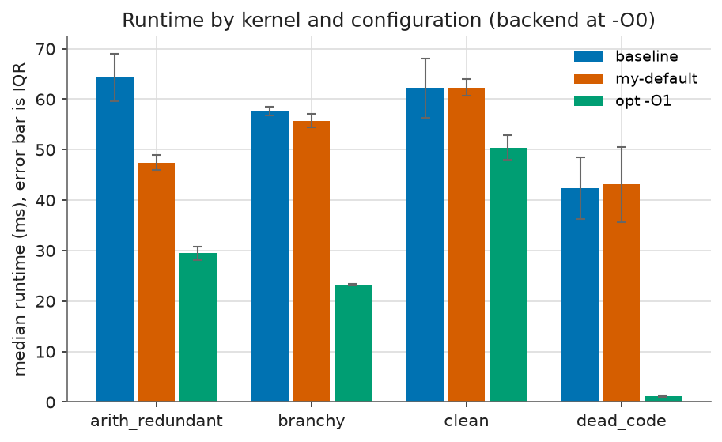
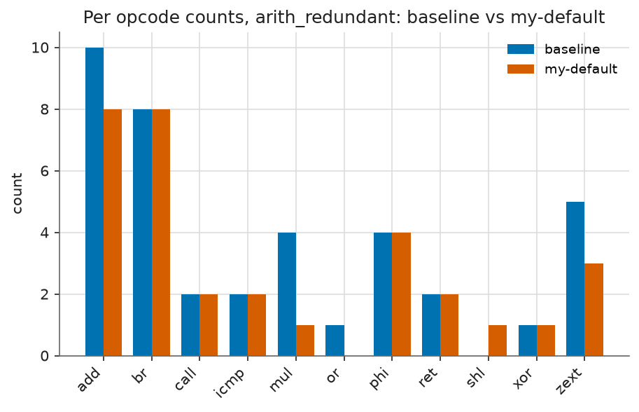

# LLVM Optimization Pass Framework

[](https://github.com/Olajide-Badejo/LLVM-Optimization-Pass-Framework/actions/workflows/ci.yml)


An out of tree **LLVM middle end optimization framework**: custom analysis and
transformation passes that load into a stock `opt` as a plugin on the new pass
manager, validated with lit/FileCheck tests and a differential execution
harness, and measured against `opt -O1` in a report whose every number is
generated from a recorded benchmark run.

This is a compiler engineering project. It demonstrates command of the LLVM
infrastructure end to end: how analyses cache and invalidate, how transforms
report exactly what they preserve, how a pipeline reaches a fixed point, and how
to prove a rewrite is correct rather than merely plausible.

> **Reports (open in the GitHub PDF viewer):**
> [Main report](assets/reports/main_report.pdf) (design, implementation, and
> measured results) and
> [Debug report](assets/reports/debug_report.pdf) (an engineering postmortem of
> what broke and how it was fixed).

---

## Highlights

- **Analyses** report real IR metrics: instruction counts by opcode, basic block
  structure, dead instructions, use-def chain depth, and simplification
  opportunities. Each has a human printer and a JSON emitter for tooling.
- **Transforms** are small and conservative: operand canonicalization, algebraic
  identity folding with strength reduction (multiply by a power of two becomes a
  shift, carrying the wrap flags), block local common subexpression elimination,
  and dead code elimination.
- **A fixed point pipeline** (`my-default`) composes them in the order that makes
  each one feed the next, with correct `PreservedAnalyses` and per iteration
  logging.
- **Correctness is proven, not assumed.** Every pattern has a lit test pinning
  the exact before and after plus negative tests for the unsafe cases, and a
  differential harness runs every kernel before and after and aborts unless the
  checksums match.
- **Honest measurement.** Every figure and number in the report is generated
  from the benchmark CSV. Where the framework does nothing useful, the report
  says so.

---

## Architecture



The analyses and transforms share their detection predicates (is this dead, is
this an identity, do these two instructions compute the same value) as free
functions, so an analysis and the transform it pairs with can never disagree.
See [docs/architecture.md](docs/architecture.md) for the full layering.

---

## Results

Four kernels exercise different parts of the framework. All numbers come from a
recorded run on an Intel Core i7-14700K under WSL2 Ubuntu, and are regenerated
from CSV by `scripts/generate_plots.py`.

### IR instruction count and reduction





| kernel | baseline | my-default | reduction | opt -O1 |
|---|---:|---:|---:|---:|
| arith_redundant | 39 | 32 | 17.9% | 34 |
| branchy | 42 | 39 | 7.1% | 44 |
| clean | 27 | 27 | 0.0% | 43 |
| dead_code | 29 | 25 | 13.8% | 14 |

`arith_redundant` has genuine scalar redundancy, so the framework both shrinks
the IR and speeds it up. `clean` is already optimal, and the framework correctly
makes **no change** at all, reported as an honest negative. On `dead_code` a real
`opt -O1` pulls far ahead by removing the entire dead loop, which the block local
passes here do not attempt.

### Runtime



On `arith_redundant` the framework moves the median from about 64 ms to about
47 ms, a difference well outside the interquartile range shown as the error bar.
On the kernels with a small structural change the runtime difference falls inside
the measurement spread and is reported as structural only, not dressed up as a
speedup.

### Where the change comes from



### Correctness

Every kernel prints a checksum, and the harness aborts unless the baseline, the
framework, and `opt -O1` all agree. Across all four kernels they do, so no
transformation changed observable behavior.

---

## Build and test

Linux, native or WSL2, against a distribution LLVM. **No LLVM source build is
required or performed.**

```bash
sudo apt-get install llvm-21-dev clang-21 llvm-21-tools clang-format-21 \
                     libgtest-dev libgmock-dev libzstd-dev \
                     cmake ninja-build latexmk texlive-latex-extra python3-venv

make build          # configure and build the plugin -> build/lib/libOPFPasses.so
make test           # build, then unit (ctest) and lit/FileCheck suites
make check-style    # dash lint, clang-format, and ruff
```

The pinned toolchain is **LLVM 21**. If a different major is installed, pass
`OPF_LLVM_MAJOR=<N>` to the make targets.

Measured on the target machine: a clean build plus the full test suite takes
about one minute, and the whole benchmark suite about seven seconds.

## Run it

```bash
# The fixed point pipeline
opt-21 -load-pass-plugin=build/lib/libOPFPasses.so -passes="my-default" -S input.ll

# The individual stages, in pipeline order
opt-21 -load-pass-plugin=build/lib/libOPFPasses.so \
       -passes="my-canon,my-simplify,my-local-cse,my-dce" -S input.ll

# A human readable analysis report
opt-21 -load-pass-plugin=build/lib/libOPFPasses.so \
       -passes="my-print-opcode-stats" -disable-output input.ll
```

See [examples/walkthrough.md](examples/walkthrough.md) for annotated before and
after IR, and [docs/usage.md](docs/usage.md) for every registered pass name.

## Reproduce the benchmarks and report

```bash
make bench          # run the differential benchmark suite, write the CSV
make report         # build the main report PDF from the committed CSV
make report-debug   # build the debug report PDF
```

## Repository layout

```text
include/opf/   public headers: analysis/, transforms/, support/
lib/           one .cpp per header, plus plugin_registration.cpp
tests/         lit/ (FileCheck IR tests), unit/ (GoogleTest)
benchmarks/    kernels/, harness/, results/
scripts/       build, test, benchmark, plot, report helpers
docs/          architecture, passes, benchmarks, usage, decisions, log
report/        main.tex and generated figures/tables
report_debug/  postmortem debug report
assets/        result images and compiled report PDFs
```

## Documentation

- [Architecture](docs/architecture.md): the analysis, transform, support, and
  registration layering.
- [Passes](docs/passes.md): each pass, why it is safe, and a before and after.
- [Benchmarks](docs/benchmarks.md): the harness workflow and how to add a kernel.
- [Usage](docs/usage.md): every pass name and `opt` invocation.
- [Design decisions](docs/design_decisions.md) and
  [engineering log](docs/ENGINEERING_LOG.md).

## License

Released under the [MIT License](LICENSE).
